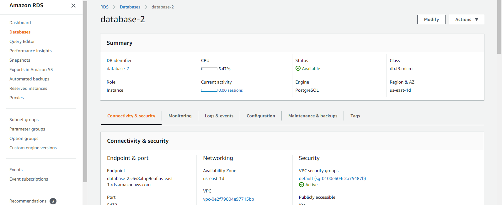
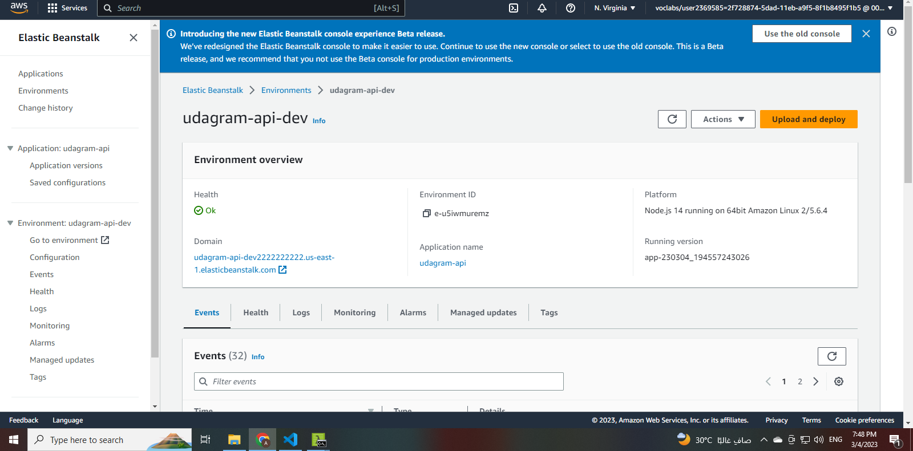
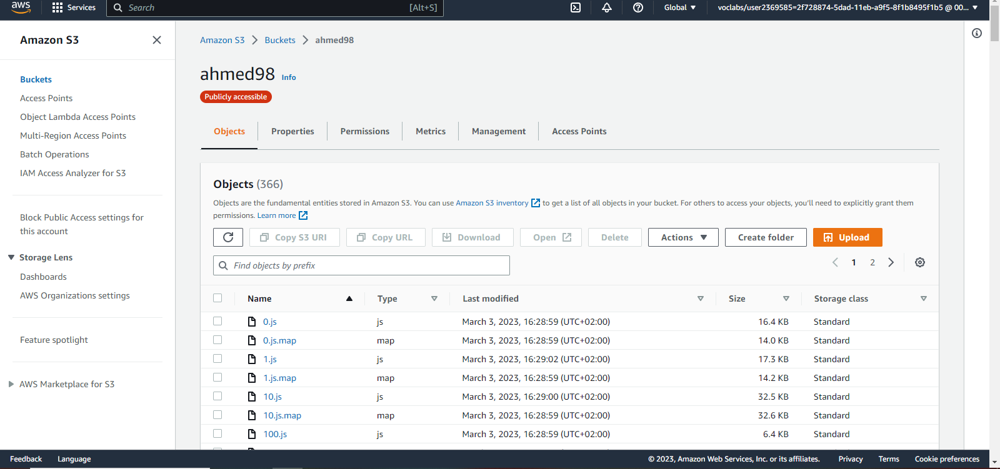

# Infrastructure description

## RDS Postgres

Using AWS RDS Postgres as application server database for storing and retrieving information.

Database endpoint: `database-2.c6v8alnp9euf.us-east-1.rds.amazonaws.com`

## Elastic Beanstalk

Elastic Beanstalk extracts and runs the application on an endpoint this application has built and uploaded on s3 bucket.
EB URL: `http://udagram-api-dev2222222222.us-east-1.elasticbeanstalk.com/` 

## S3 Bucket

The frontend application is deployed using AWS S3 Bucket
Bucket URL: `http://ahmed98.s3-website-us-west-2.amazonaws.com`
